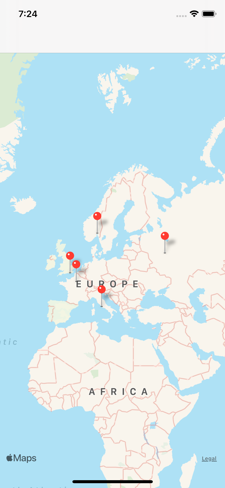
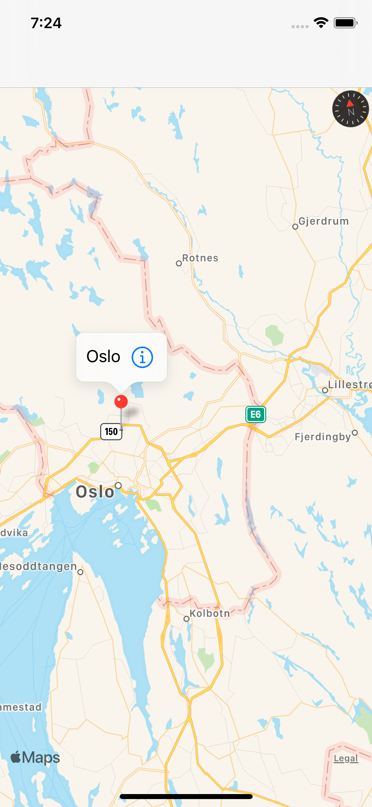
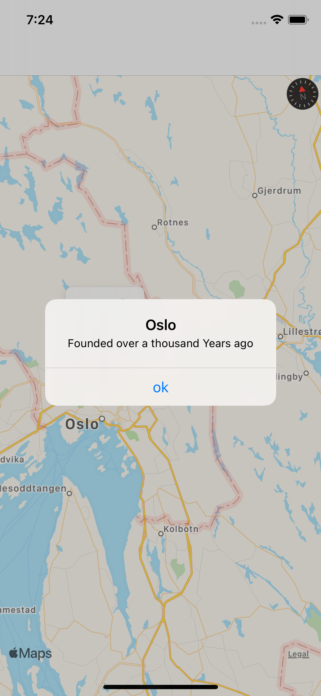

# MapCapitals
The app showing main capitals on the map
## Tools implemented in project

  - MKMapView

  - MKAnnotation

  - CLLocationCoordinate2D

  - MapKit

  - info

  - addAnnotations

  - MKPinAnnotationView
 
 ## Project Screen Shots
 

## Supported devices
iPhone 6S and 6S Plus.  
iPhone SE.  
iPhone 7 and 7 Plus.  
iPhone 8 and 8 Plus.  
iPhone X.  
iPhone XS, XS Max and XR.  
iPhone 11, 11 Pro and 11 Pro Max.  

## More features soon 

- more capitals

- pictures to show the place 
